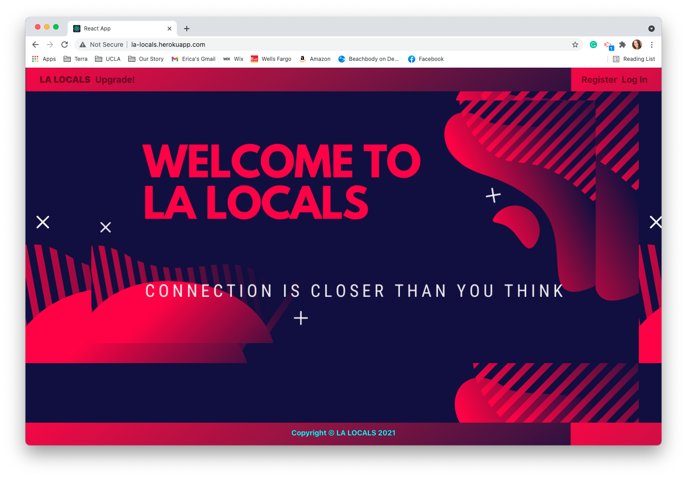
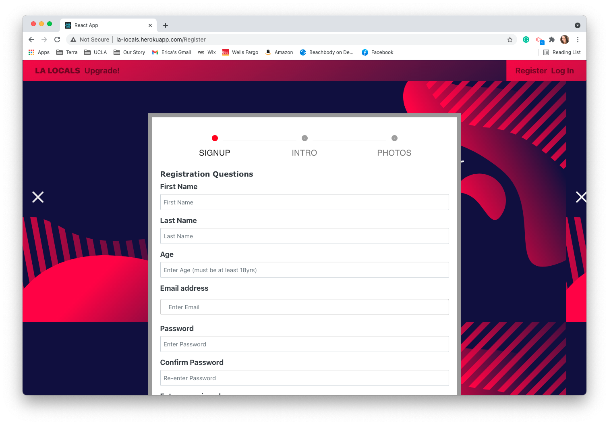
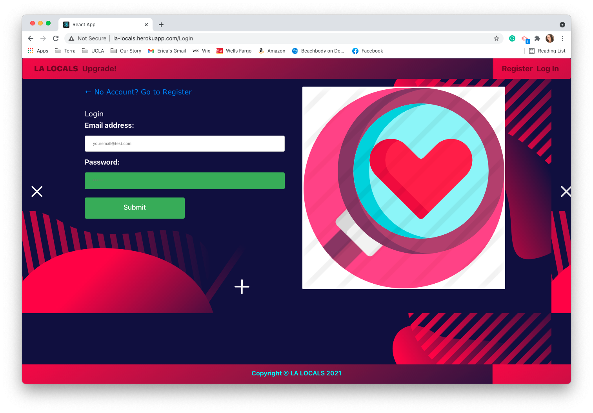
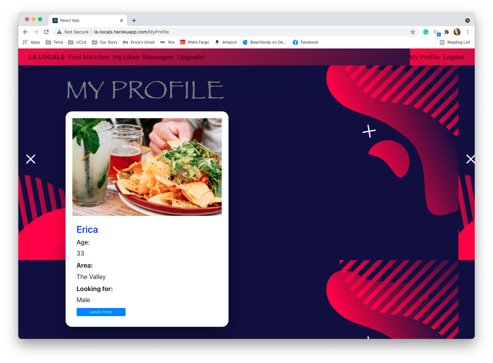
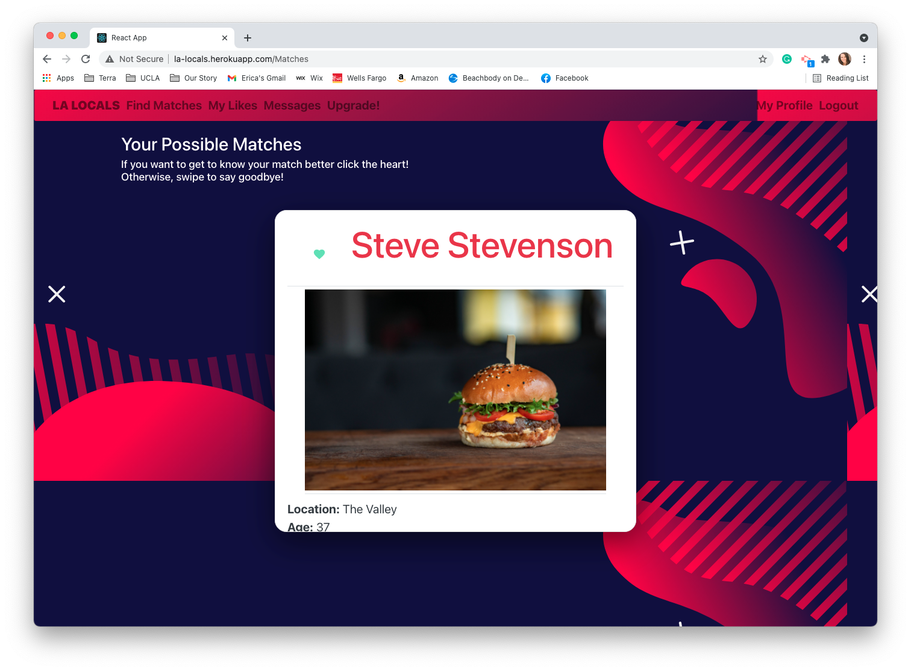
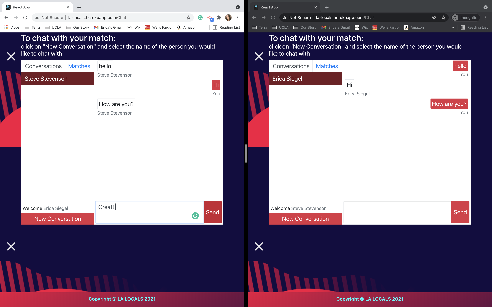
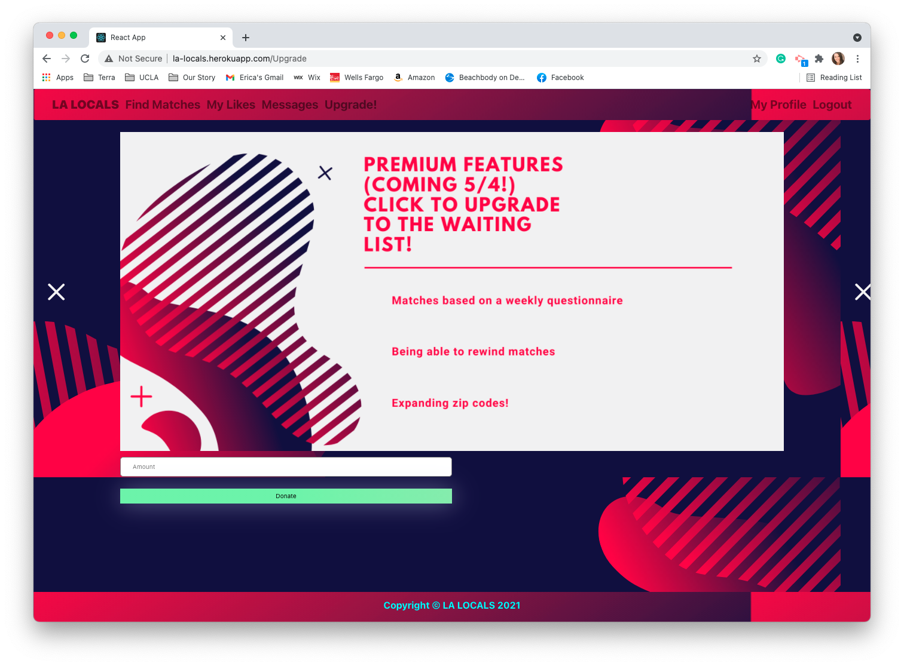

# LA Locals
  

 
## Description
LA Locals is a dating app created for locals of Los Angeles who only want to meet people local to the town they live in. 

## To See Matches Select Zipcode 91406

1. User fills out registration where they will be assigned which out of the 4 areas in LA their zip code falls into. They will also add 1 photo of themselves during the registration. As well as answer all the questions in the questionnaire
2. The User’s information from the registration (the region mainly) and questionnaire answers will populate the Users profile.
3. The User with then navigate to dashboard to see possible matches that are both regional and based on similar answers of other users.
4. The user will select profiles presented to them by “liking” them. Then the User will see their name in the inbox.
5. Once the User receives a mutual like they will both be able to message each other.

## Table of Contents
  
* [Description](#description)
* [Features](#features)
* [Technologies](#technologies)
* [Links](#link)
* [Usage](#usage)
* [Installation](#installation)
* [Screenshots](#screenshots)
* [License](#license)

## Features
    
- User Interface
- Find Matches
- Upload a photo
- Message your Liked Users

## Technologies

JavaScript, HTML, CSS, Node, Socket.Io, DotEnv, React, GraphQL, Bootstrap, Material.ui, Express, Bcypt, JWT, Google Firebase, Stripe, Apollo

## Link 

[LA Locals Deployed Page](http://la-locals.herokuapp.com/)

[LA Locals GitHub](https://github.com/stepheff1994/la-locals-project.git)

## Usage

LA Locals is the dating app you can join to view singles in your area and potentially make a love match.

### App Instructions
    
- Create an account using your email, username, and a unique password
      
- Upon Sign Up you will be redirected to the main page of the site.
      
- You can view your profile.
      
- You can see who your matches are, add them to your likes, and message them.
      
## Screenshots
    
### Main Page

### Sign Up Page

      
### Log In Page

      
### Dashboard

      
### Matches

      
### Upgrade

      
### Chat

## Credits

- [Arlon Tuazon](https://github.com/ArlonTuazon)
- [Franciso Ramos](https://github.com/eramos3)
- [Stephanie Freyler](https://github.com/stepheff1994)
- [Erica Siegel](https://github.com/ericasiegel)

    

## License

This project is covered under MIT License

